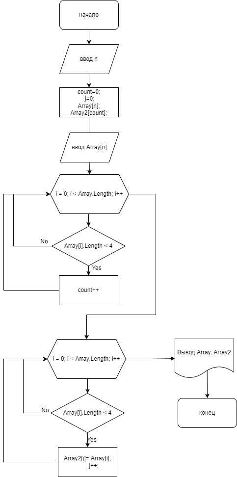

# Порядок выполнения итоговой работы
## Создание репозитория
1. Создана новая папка LastHomeWork на локальном рабочем месте
2. Создан новый репрзиторий в этой папке
3. Создан репозиторий на GH
4. Связаны репозитории
## Решение задачи в VS Code
1. Размер и элементы массива должны быть введены с консоли,для этого:
* задаем целое число n, которое будет являться размером массива
* задаем массив string[] Array
* через цикл for заполняем массив с консоли
* печатаем массив
2. Выполняем проверку элементов массива и определяем размер нового массива
* задаем счетчик count = 0, который определит размер нового массива
* в цикле for проводим подсчет элементов массива, количество символов которых меньше или равно 3
3. Задаем  новый массив размеров count и переменную int j =0
5. В цикле for выполняем проверку элементов, если символов <= 3(<4), то элемент записываем в новый массив
## Блок-схема алгоритма решения
1. Решение задачи описано блок-схемой
2. Файл  с изображением блок-схемы добавлен в папку с локальным репозиторим
## Файлы отправлены на репозиторий в GH